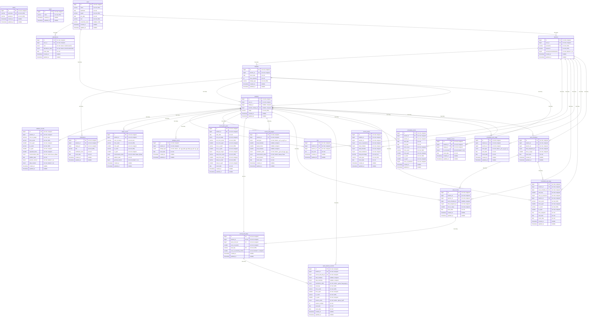

```mermaid
erDiagram
    addition_records {
        bigint id PK "not null, unsigned"
        bigint student_id FK "not null, unsigned"
        decimal num_of_pages "not null, (4,2)"
        varchar from_surah "not null, (255)"
        smallint from_ayah "not null, unsigned"
        varchar to_surah "not null, (255)"
        smallint to_ayah "not null, unsigned"
        smallint repeated_times "not null, unsigned"
        enum memorization_state "not null, values: حفظ,لم يحفظ"
        date addition_date "not null"
        tinyint general_revision "not null, default: 0, (1)"
        tinyint daily_revision "not null, default: 0, (1)"
        timestamp created_at "nullable"
        timestamp updated_at "nullable"
    }
    admin {
        bigint id PK "not null, unsigned"
        varchar username UK "not null, (255)"
        varchar password "not null, (255)"
        timestamp created_at "nullable"
        timestamp updated_at "nullable"
    }
    attendances {
        bigint id PK "not null, unsigned"
        bigint user_id FK "not null, unsigned"
        enum role "not null, values: student,teacher"
        enum attendance_state "not null, values: present,absent,late"
        date insert_date "not null"
        timestamp created_at "nullable"
        timestamp updated_at "nullable"
    }
    etqan_record {
        bigint id PK "not null, unsigned"
        bigint student_id FK "not null, unsigned"
        decimal num_of_sheets "not null, (4,2)"
        varchar from_surah "not null, (255)"
        smallint from_ayah "not null, unsigned"
        varchar to_surah "not null, (255)"
        smallint to_ayah "not null, unsigned"
        enum memorization_state "not null, values: حفظ,لم يحفظ"
        date addition_date "not null"
        tinyint general_revision "not null, default: 0, (1)"
        timestamp created_at "nullable"
        timestamp updated_at "nullable"
    }
    halaqats {
        bigint id PK "not null, unsigned"
        bigint teacher_id FK "not null, unsigned"
        date insert_date "not null"
        int max_students "not null"
        varchar halaqa_type "not null, (255)"
        timestamp created_at "nullable"
        timestamp updated_at "nullable"
    }
    notifications {
        bigint id PK "not null, unsigned"
        bigint student_id FK "not null, unsigned"
        bigint halaqa_id FK "not null, unsigned"
        varchar title "not null, (255)"
        time notification_time "not null"
        date insert_date "not null"
        timestamp created_at "nullable"
        timestamp updated_at "nullable"
    }
    nots {
        bigint id PK "not null, unsigned"
        bigint student_id FK "not null, unsigned"
        bigint teacher_id FK "not null, unsigned"
        text text_nots "not null"
        timestamp created_at "nullable"
        timestamp updated_at "nullable"
    }
    pledges_record {
        bigint id PK "not null, unsigned"
        bigint student_id FK "not null, unsigned"
        enum pledge_type "not null, values: تعهد ربط عام,تعهد إضافة,تعهد نظام,تعهد غياب"
        date insert_date "not null"
        timestamp created_at "nullable"
        timestamp updated_at "nullable"
    }
    record_exams {
        bigint id PK "not null, unsigned"
        bigint student_id FK "not null, unsigned"
        bigint teacher_id FK "not null, unsigned"
        tinyint num_of_questions "not null, unsigned"
        tinyint total_mistakes "not null, unsigned"
        tinyint total_melodies "not null, unsigned"
        tinyint total_hesitiations "not null, unsigned"
        decimal final_percentage "not null, (5,2)"
        varchar exam_type "not null, (255)"
        date insert_date "not null"
        timestamp created_at "nullable"
        timestamp updated_at "nullable"
    }
    record_plan_years {
        bigint id PK "not null, unsigned"
        bigint student_id FK "not null, unsigned"
        date start_date "not null"
        tinyint min_juz_target "not null, unsigned"
        varchar min_from_surah "not null, (255)"
        smallint min_from_ayah "not null, unsigned"
        varchar min_to_surah "not null, (255)"
        smallint min_to_ayah "not null, unsigned"
        tinyint ideal_juz_target "not null, unsigned"
        varchar ideal_from_surah "not null, (255)"
        smallint ideal_from_ayah "not null, unsigned"
        varchar ideal_to_surah "not null, (255)"
        smallint ideal_to_ayah "not null, unsigned"
        date insert_date "not null"
        timestamp created_at "nullable"
        timestamp updated_at "nullable"
    }
    record_sard_days {
        bigint id PK "not null, unsigned"
        bigint student_id FK,UK "not null, unsigned"
        bigint sard_record_id FK "not null, unsigned"
        smallint num_of_session "not null, unsigned"
        varchar sard_day UK "not null, (255)"
        smallint num_of_remaining_sheets "not null, default: 0, unsigned"
        timestamp created_at "nullable"
        timestamp updated_at "nullable"
    }
    record_sard_stages {
        bigint id PK "not null, unsigned"
        bigint student_id FK "not null, unsigned"
        enum sard_type "not null, values: سرد أول,سرد ثاني"
        smallint total_melodies "nullable, unsigned"
        smallint repeat_times "nullable, unsigned"
        smallint total_mistakes "nullable, unsigned"
        enum hesitation_state "not null, values: مرتفع,متوسط,منخفض"
        enum memorization_state "not null, values: حفظ,لم يحفظ"
        time sard_duration "not null"
        date insert_date "not null"
        timestamp created_at "nullable"
        timestamp updated_at "nullable"
    }
    region {
        bigint id PK "not null, unsigned"
        varchar name "not null, (255)"
        timestamp created_at "nullable"
        timestamp updated_at "nullable"
    }
    sard_records {
        bigint id PK "not null, unsigned"
        bigint student_id FK "not null, unsigned"
        bigint teacher_id FK "not null, unsigned"
        bigint serd_schedule_id FK "nullable, unsigned"
        tinyint total_assigned_juz "not null, unsigned"
        smallint num_of_days "not null, unsigned"
        date insert_date "not null"
        timestamp created_at "nullable"
        timestamp updated_at "nullable"
    }
    sard_sessions_records {
        bigint id PK "not null, unsigned"
        bigint student_id FK "not null, unsigned"
        bigint record_sard_day_id FK "not null, unsigned"
        tinyint total_mistakes "nullable, unsigned"
        tinyint total_melodies "nullable, unsigned"
        enum hesitiations_state "not null, values: مرتفع,متوسط,منخفض"
        varchar serd_day "not null, (255)"
        varchar from_surah "not null, (255)"
        smallint from_ayah "not null, unsigned"
        varchar to_surah "not null, (255)"
        smallint to_ayah "not null, unsigned"
        enum session_state "not null, values: أكمل,لم يكمل"
        int session_number "not null"
        date sard_date "not null"
        date insert_date "not null"
        timestamp created_at "nullable"
        timestamp updated_at "nullable"
    }
    scheduled_exams {
        bigint id PK "not null, unsigned"
        bigint student_id FK "not null, unsigned"
        bigint teacher_id FK "not null, unsigned"
        date start_date "not null"
        date end_date "not null"
        tinyint num_of_juz "not null, unsigned"
        varchar from_surah "not null, (255)"
        smallint from_ayah "not null, unsigned"
        varchar to_surah "not null, (255)"
        smallint to_ayah "not null, unsigned"
        tinyint num_of_questions "not null, unsigned"
        timestamp created_at "nullable"
        timestamp updated_at "nullable"
    }
    scheduled_sard_days {
        bigint id PK "not null, unsigned"
        bigint student_id FK "not null, unsigned"
        bigint serd_schedule_id FK "not null, unsigned"
        smallint sard_day "not null, unsigned"
        tinyint num_of_sessions "not null, unsigned"
        bigint teacher_id FK "not null, unsigned"
        varchar from_surah "not null, (255)"
        smallint from_ayah "not null, unsigned"
        varchar to_surah "not null, (255)"
        smallint to_ayah "not null, unsigned"
        time time_assigned "not null"
        date sard_date "not null"
        date insert_date "not null"
        timestamp created_at "nullable"
        timestamp updated_at "nullable"
    }
    scheduled_sard_stage {
        bigint id PK "not null, unsigned"
        bigint student_id FK "not null, unsigned"
        bigint teacher_id FK "not null, unsigned"
        enum sard_type "not null, values: سرد أول,سرد ثاني"
        date sard_date "not null"
        date insert_date "not null"
        timestamp created_at "nullable"
        timestamp updated_at "nullable"
    }
    serd_schedules {
        bigint id PK "not null, unsigned"
        bigint student_id FK "not null, unsigned"
        bigint teacher_id FK "not null, unsigned"
        tinyint total_assigned_juz "not null, unsigned"
        smallint num_of_days "not null, unsigned"
        date insert_date "not null"
        timestamp created_at "nullable"
        timestamp updated_at "nullable"
    }
    students {
        bigint id PK "not null, unsigned"
        bigint user_id FK "not null, unsigned"
        bigint halaqa_id FK "nullable, unsigned"
        bigint tassheh_halaqa_id FK "nullable, unsigned"
        varchar stage "not null, (255)"
        timestamp created_at "nullable"
        timestamp updated_at "nullable"
    }
    tassheh_record {
        bigint id PK "not null, unsigned"
        bigint student_id FK "not null, unsigned"
        bigint halaqa_id FK "not null, unsigned"
        tinyint Is_corrected "not null, default: 0, (1)"
        date insert_date "not null"
        timestamp created_at "nullable"
        timestamp updated_at "nullable"
    }
    teachers {
        bigint id PK "not null, unsigned"
        bigint user_id FK "not null, unsigned"
        varchar username UK "not null, (255)"
        varchar password "not null, (255)"
        tinyint canSurpriseTestStudents "not null, default: 0, (1)"
        timestamp created_at "nullable"
        timestamp updated_at "nullable"
    }
    users {
        bigint id PK "not null, unsigned"
        varchar name "not null, (255)"
        date barthdate "not null"
        varchar region "not null, (255)"
        date join_date "not null"
        varchar role "not null, (255)"
        varchar remember_token "nullable, (100)"
        timestamp created_at "nullable"
        timestamp updated_at "nullable"
    }
    students ||--o{ addition_records : "has many"
    users ||--o{ attendances : "has many"
    students ||--o{ etqan_record : "has many"
    teachers ||--o{ halaqats : "has many"
    halaqats ||--o{ notifications : "has many"
    students ||--o{ notifications : "has many"
    students ||--o{ nots : "has many"
    teachers ||--o{ nots : "has many"
    students ||--o{ pledges_record : "has many"
    students ||--o{ record_exams : "has many"
    teachers ||--o{ record_exams : "has many"
    students ||--o{ record_plan_years : "has many"
    sard_records ||--o{ record_sard_days : "has many"
    students ||--|| record_sard_days : "has one"
    students ||--o{ record_sard_stages : "has many"
    serd_schedules o|--o{ sard_records : "has many"
    students ||--o{ sard_records : "has many"
    teachers ||--o{ sard_records : "has many"
    record_sard_days ||--o{ sard_sessions_records : "has many"
    students ||--o{ sard_sessions_records : "has many"
    students ||--o{ scheduled_exams : "has many"
    teachers ||--o{ scheduled_exams : "has many"
    serd_schedules ||--o{ scheduled_sard_days : "has many"
    students ||--o{ scheduled_sard_days : "has many"
    teachers ||--o{ scheduled_sard_days : "has many"
    students ||--o{ scheduled_sard_stage : "has many"
    teachers ||--o{ scheduled_sard_stage : "has many"
    students ||--o{ serd_schedules : "has many"
    teachers ||--o{ serd_schedules : "has many"
    halaqats o|--o{ students : "has many"
    halaqats o|--o{ students : "has many"
    users ||--o{ students : "has many"
    halaqats ||--o{ tassheh_record : "has many"
    students ||--o{ tassheh_record : "has many"
    users ||--o{ teachers : "has many"

```
